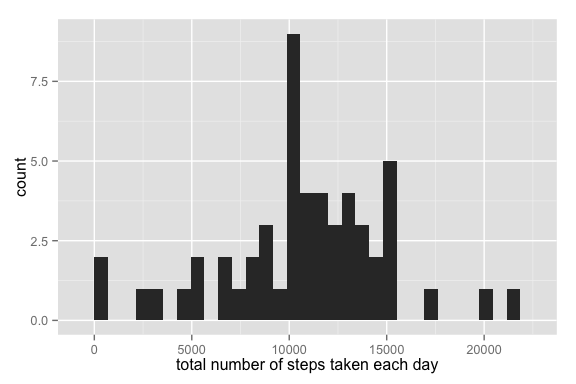

# Reproducible Research: Peer Assessment 1

## Loading and preprocessing the data
To start, let us set the working directory to the local cloned directory, unzip and load the data.

```r
setwd("~/Documents/Data_Science/Reproducible_Research/RepData_PeerAssessment1/")
unzip("activity.zip")
activity<-read.csv("activity.csv")
echo="TRUE"
```
The dates are in "factor" format, we put them to date format with the `as.Date` function.


```r
date<-as.Date(as.character(activity$date))
activity$date<-date
```
## What is mean total number of steps taken per day?
In the following chunk of code, we compute the number of total steps per day:

```r
totalsteps<-aggregate(activity$steps, list(period=activity$date), sum, na.rm=TRUE)
head(totalsteps)
```

```
##       period     x
## 1 2012-10-01     0
## 2 2012-10-02   126
## 3 2012-10-03 11352
## 4 2012-10-04 12116
## 5 2012-10-05 13294
## 6 2012-10-06 15420
```
We load the ggplot2 library and make a histogram of the total number of steps per day:

```r
library(ggplot2)
```


```r
qplot(as.vector(totalsteps[,2]), xlab = "total number of steps taken each day")
```

 

We then compute the mean and the median of the number of steps per day:


```r
meansteps<-aggregate(activity$steps,list(period=activity$date), mean, na.rm=TRUE)
meansteps<-subset(meansteps,subset=complete.cases(meansteps))
colnames(meansteps)<-c("Days", "Mean Step Number")
row.names(meansteps)<-NULL
mediansteps<-aggregate(activity$steps, list(period=activity$date), median, na.rm=TRUE)
mediansteps<-subset(mediansteps,subset=complete.cases(meansteps))
```
Then, we create the tables for the mean and median values:

```r
library(knitr)
kable(head(meansteps)); kable(head(mediansteps))
```


Days          Mean Step Number
-----------  -----------------
2012-10-02             0.43750
2012-10-03            39.41667
2012-10-04            42.06944
2012-10-05            46.15972
2012-10-06            53.54167
2012-10-07            38.24653


period         x
-----------  ---
2012-10-01    NA
2012-10-02     0
2012-10-03     0
2012-10-04     0
2012-10-05     0
2012-10-06     0


## What is the average daily activity pattern?


## Imputing missing values


## Are there differences in activity patterns between weekdays and weekends?
